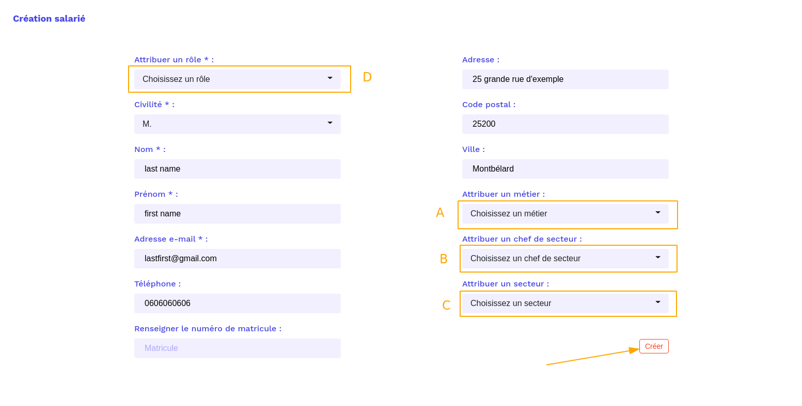
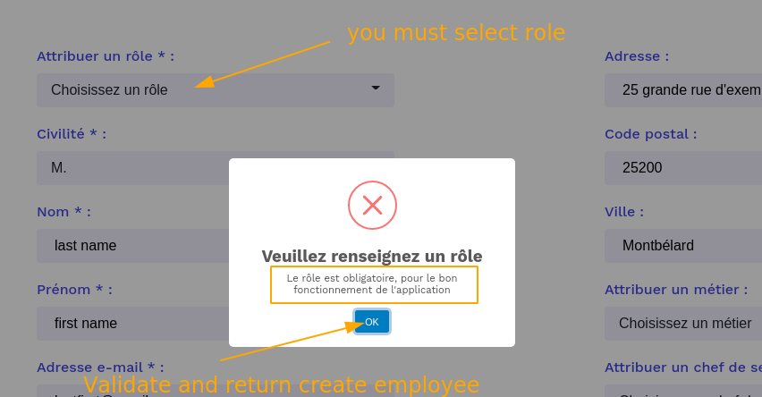
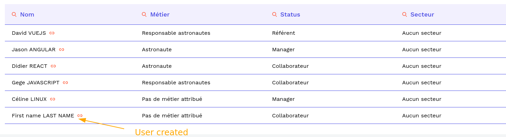
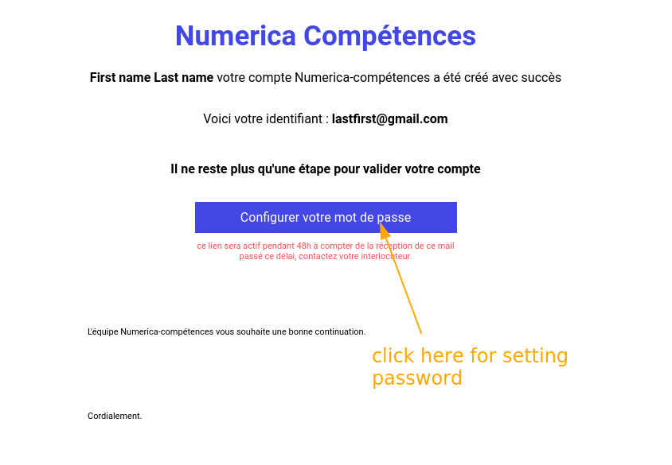
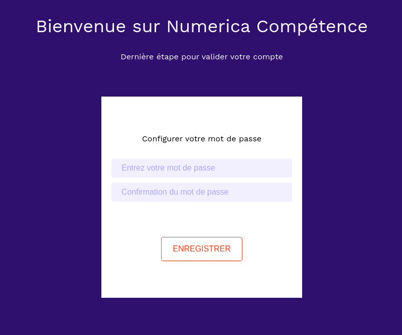

### Create employee

---



- A

```
Selected trades of current company
```

- B

```
Choice a lead of new employee
```

- C

```
Choice a sector of new employee
```

- D

```
Choice a role of new employee
It's obligatory
```

---

- if you do not choose a role, an error appears,  
  you will have to click on ok and select a role  
  in the "choose a role" field



---

- When all the mandatory fields are created  
  the user will receive an email  
  to configure his password



- This mail



- Setting password



---
