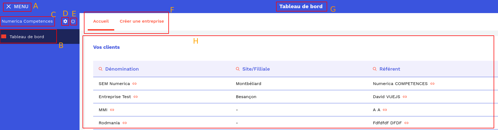

### Dashboard

- Here is the main dashboard (root user login)



- A

```
Allows you to open or close the menu, to have more room
for the content to view
```

- B

```
Access to the general dashboard
```

- C

```
Name of user connected
```

- D

```
Access to setting of app
```

- E

```
Logout
```

- F

```
Submenu of displayed content
```

- G

```
Title of displayed content
```

- H

```
Display content
```
