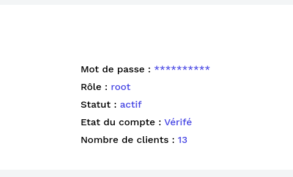

### The Rôles of users

        Here in the settings section, you can see the
        roles of the logged in user on the right.

> We can see the "root", there are 5 different roles

- "root" => all access rights
- "administrateur" => Create company, employee, job description, interview
- "référent" => Create employee, job description, interview
- "manager" => Access interview and his profile
- "collaborateur" => Access his profile

> "root" create any roles for users  
> "administrateur" create référent, manager and collaborateur  
> "referent" create manager and collaborateur  
> "manager and collaborateur" can't create anything
